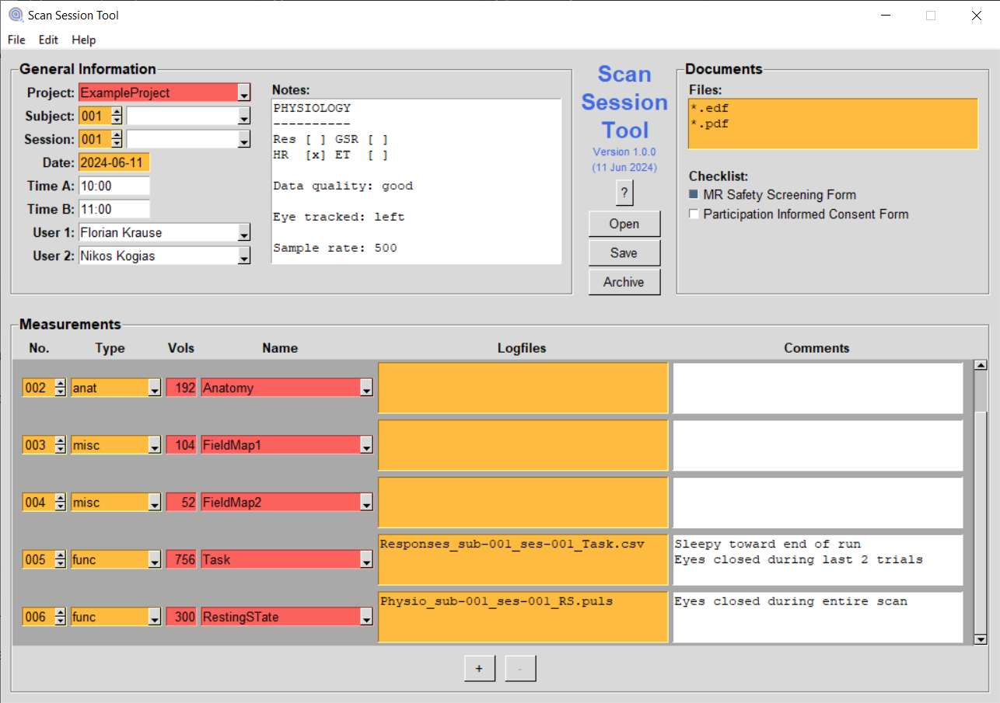
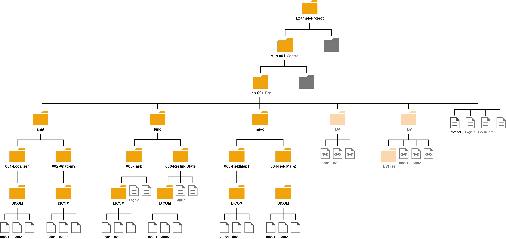

# Summary

TODO: Short intro?

Scan Session Tool is a cross-platform (Windows, MacOS, Linux) graphical
application for standardized real-time documentation of (functional) Magnetic
Resonance Imaging (MRI) scan sessions and automatized archiving of the collected
(raw) data. The software allows session information (i.e. metadata, project- and
subject-specific notes/documents, as well as a detailed log of acquired MRI
measurements) to be entered in a fast and convenient way during a session (see
also \autoref{fig:Figure1}) and to be saved into a human- and machine-readable
protocol file (in YAML format).
The software then uses this scan session documentation to automatically organize
the raw data (i.e. DICOM images) of all acquired measurements, as well as any
related logfiles (e.g. stimulation protocols, response time recordings, etc.)
into a unified hierarchical folder structure for archiving purposes (see also
\autoref{fig:Figure2}).
In addition, the software has (optional) sepcial support for BrainVoyager and
(Turbo-)BrainVoyager (which is commonly used for real-time functional MRI
measurements).

# Statement of need
TODO: Problem description

Scan Session Tool was written to be used by neuroscientists, to help them
increase transparency and reproducibilty of their MRI research by standardizing
scan session documentation and raw data archiving. The software has already
been succesfully used during data collection of recent MRI studies ([e.g.
@krause_real-time_2017; @luhrs_potential_2019; @krause_active_2019];
@krause_self-regulation_2021], and its standardized scan session documentation
as well as archiving structure are already part of open datasets [e.g. 
@krause_self-regulation_2021_data]. The archiving structure is furthermore
automatically recognized by BIDScoin [@zwiers_bidscoin_2021], which allows the
raw DICOM data archived with Scan Session Tool to be further converted to the Brain
Imaging Data Structure [BIDS; @gorgolewski_brain_2016] if desired.

# Figures

# References

