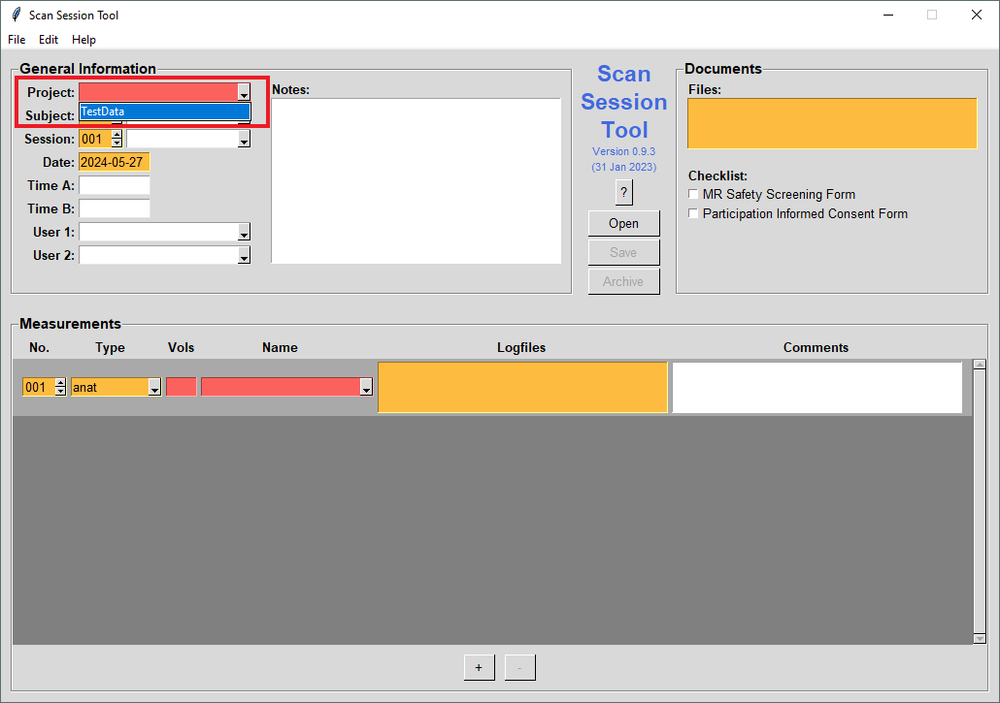
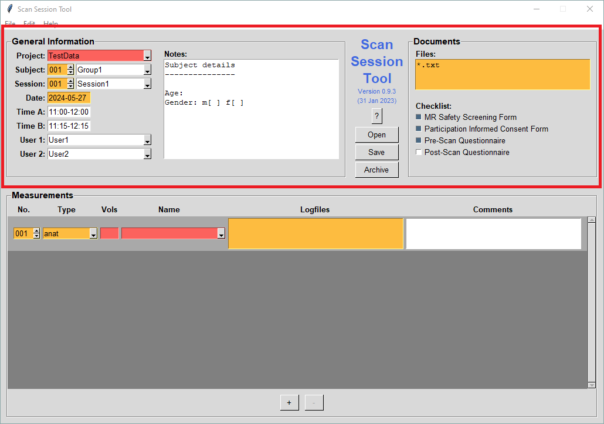
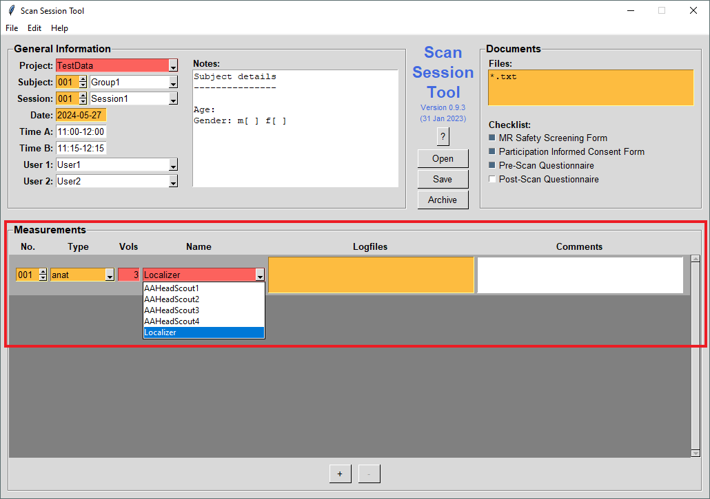
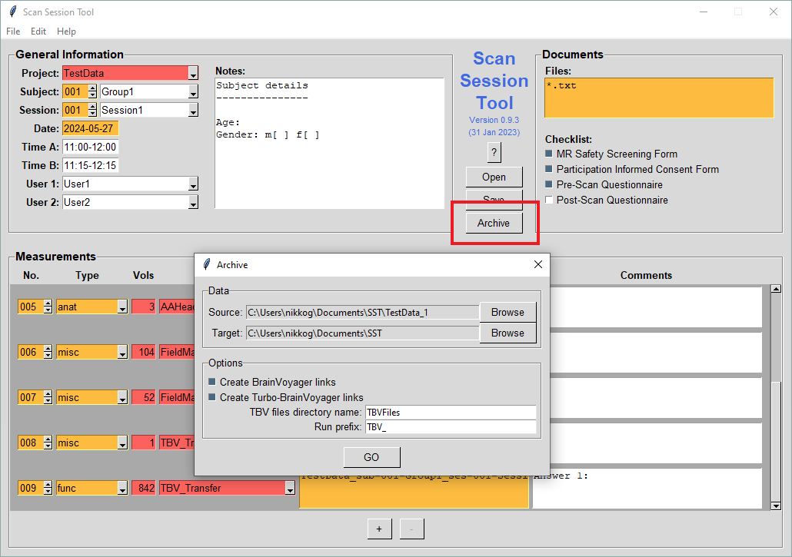

# Scan Session Tool example usage tutorial
Follow the instructions for an example usage of the Scan Session Tool graphical interface. The instructions will guide you through recording scan session information, saving to a scan protocol file, as well as archiving the session data.

**General information**
1. Download the [TestData.zip](https://github.com/fladd/ScanSessionTool/raw/master/tests/TestData.zip) folder and extract the contents locally. This folder contains an example dataset with Localizer, AAHeadScout, FieldMap, and TBV_Transfer scans. The data are organised either in separate folders per acquired sequence number (`TestData_1`) or in a single folder containing all scans  (`TestData_2`). Scan Session Tool can handle either data format. An adjusted settings file (`sst.yaml`) is also available.  
2. In your terminal navigate to the unzipped folder and start the program by typing `scansessiontool`. 
3. To populate the fields and options with predefined values from the settings file a project must be selected in the “Project” field. Select “TestData” from the dropdown menu.

4. You can now make changes to the session information. That is, change fields in "General Information" and “Documents”. Some fields have a dropdown menu with available options, however it is also possible to freely type a new entry not present in the options.

  

**Measurements**

5. Once the general information is entered you can start adding scan specific information in the “Measurements” section. You can select the “Type” of scan (e.g. anat, func) and the specific “Name” of the scan. The “Vols” section will be automatically filled with the number of volumes you specified for this scan in the `sst.yaml` file. There is a field for scan-specific "Logfiles" such us stimulus protocols etc. Finally, there is a “Comments”  field to add any scan-specific comments (e.g. the participant was sleepy during this task).
6. First go to measurement “001” under the “No.” field. Next select the “anat” in the “Type” field. In the dropout menu under “Name” select “Localizer”. Notice that the “Vols” section is automatically updated to match the expected volumes of this scan as specified in the sst.yaml file.

7. Next continue with the AAHeadScout scan. This is an example of a sequence that produces multiple sequence numbers. Each of them has to be added as a separate measurement. Add four new measurements by clicking on the “+” button bellow the “Measurements” section. In each of the measurements select the “anat” type and then AAHeadScout1, AAHeadScout2, AAHeadScout3, AAHeadScout4 respectively in the “Name” field.
8. Continue by adding two new measurements for the Field Map. Select the “misc” scan type in “Type” and the “Name” FieldMap1, and FieldMap2 respectively. 
9. Next add two new measurements for the functional scan. The first one is a reference image. Select “misc” in “Type” and “TBV_Transfer-SBRef” in “Name”.  The second one contains the functional data. Select “func” in “Type” and “TBV_Transfer” in “Name”.
10. Once you are done click on "Save" (either in the main area of the user interface, or in the *File* menu) and save the scan session information into a new protocol file (e.g. `ScanProtocol_SaveTest.txt`).

**Archiving data**

11. Click on "Archive" (either in the main area of the user interface, or in the *File* menu). A dialogue window should open.
12. Click on "Browse" next to *Source* and select one of the test data directories (i.e. `TestData_1` or `TestData_2`).
13. Click on "Browse" next to *Target* and select a directory to save the archived data to.
14. Under *Options* tick both "Create BrainVoyager links" and "Create Turbo-Brain Voyager links".
15. Click on "GO". This will start the archiving process (which will take a couple of minutes; progress is shown in a green overlay window).

